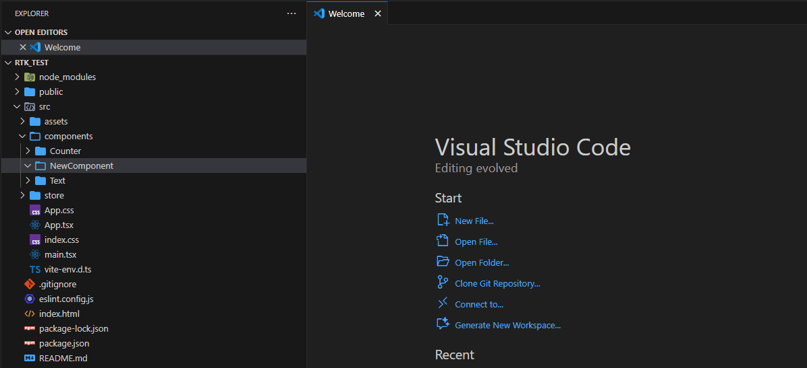
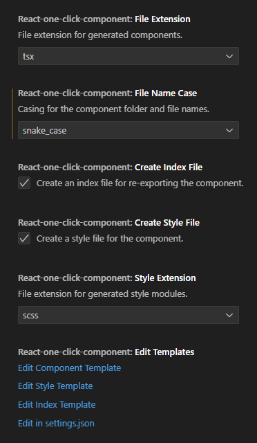
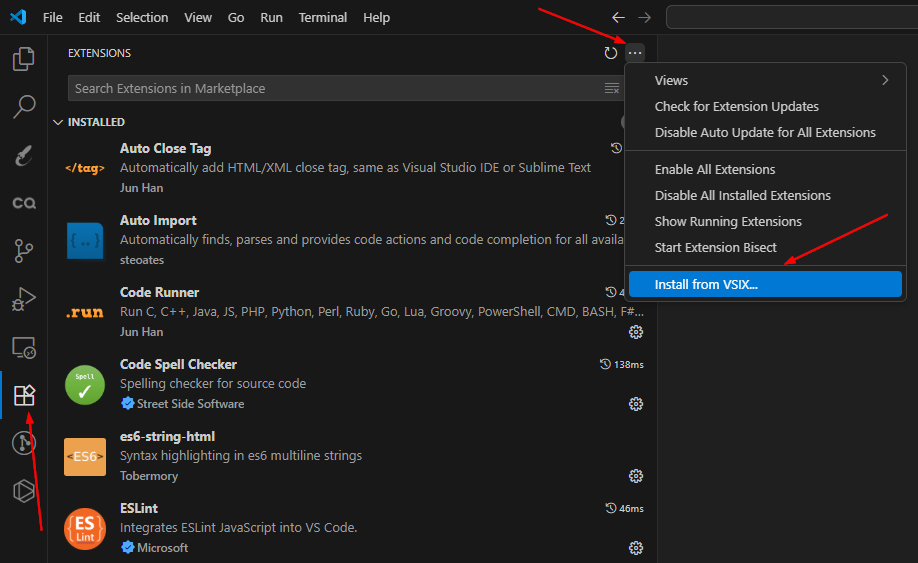

# React Quick Component

Quickly generate React component files (component, style, index) directly from the VS Code explorer context menu. This extension is designed to streamline your workflow by creating a consistent and customizable file structure for your React components.



## Features

-   **One-Click Generation**: Create a full component structure by right-clicking on a folder.
-   **Customizable File Naming**: Choose from `PascalCase`, `camelCase`, `kebab-case`, or `snake_case` for your generated files.
-   **Flexible File Extensions**: Supports both `.tsx` and `.jsx`.
-   **Optional Files**: Easily enable or disable the creation of `index` and style files.
-   **Multiple Style Options**: Supports `scss`, `css`, `less`, and `sass` for style files.
-   **Editable Templates**: Customize the content of generated files by editing the base templates directly within VS Code.

## Usage

1.  In the VS Code Explorer, right-click on the folder where you want to create the component.
2.  Select **"⚛️ Generate React Component"** from the context menu.
3.  The extension will automatically create linked component files based on the folder name and your configured settings.

For example, right-clicking on a folder named `my-button` with the default setting `fileNameCase: 'camelCase'` will generate:
-   `myButton.tsx`
-   `myButton.module.scss`
-   `index.ts`

If you set `fileNameCase: 'PascalCase'`, the result will be:
-   `MyButton.tsx`
-   `MyButton.module.scss`
-   `index.ts`

These files already have the necessary code and imports to work together.

## Configuration

You can customize the extension's behavior via the VS Code settings (`settings.json`).

| Setting | Description | Options | Default |
|---|---|---|---|
| `react-quick-component.fileExtension` | File extension for generated components. | `tsx`, `jsx` | `tsx` |
| `react-quick-component.fileNameCase` | Casing for the component file names. The component name inside the file will always be `PascalCase`. | `PascalCase`, `camelCase`, `kebab-case`, `snake_case` | `camelCase` |
| `react-quick-component.createIndexFile` | Create an `index` file for re-exporting the component. | `true`, `false` | `true` |
| `react-quick-component.createStyleFile` | Create a style file for the component. | `true`, `false` | `true` |
| `react-quick-component.styleExtension` | File extension for generated style modules. | `scss`, `css`, `less`, `sass` | `scss` |

### How to Edit Templates

You can easily edit the templates used for file generation. Open the command palette (`Ctrl+Shift+P` or `Cmd+Shift+P`) and search for:

-   `React Quick Component: Edit Component Template`
-   `React Quick Component: Edit Style Template`
-   `React Quick Component: Edit Index Template`

Alternatively, you can find clickable links in the extension's settings UI.



> **Note on using `.jsx`:** The default component template includes TypeScript syntax (e.g., `FC` type). If you set the `fileExtension` to `jsx`, you should edit the component template to remove any TypeScript-specific code. Use the `Component Generator: Edit Component Template` command to do this.

The following placeholders are available in the templates:
#### For `component.template`:
-   `${componentName}`: The name of the component in `PascalCase` (e.g., `MyButton`).
-   `${styleImportBlock}`: A block for the style import. Automatically adds `import styles from './...'` if `createStyleFile` is enabled, otherwise it's an empty string.
-   `${classNameProp}`: The `className` attribute for the root element. Automatically adds ` className={styles.yourClassName}` if `createStyleFile` is enabled, otherwise it's an empty string.

#### For `style.template`:
-   `${className}`: The CSS class name, always in `camelCase` (e.g., `myButton`).

#### For `index.template`:
-   `${componentName}`: The name of the component in `PascalCase` (e.g., `MyButton`).
-   `${fileName}`: The base name for the files, formatted according to the `fileNameCase` setting (e.g., `myButton` or `my-button`).

## Development and Local Installation

Since this extension is not yet published on the VS Code Marketplace, you can build and install it locally by following these steps.

1.  **Clone the repository:**
    ```bash
    git clone https://github.com/winkyBrain/react-quick-component.git
    ```
    or with SSH
    ```bash
    git clone git@github.com:winkyBrain/react-quick-component.git
    ```
    ```bash
    cd react-quick-component
    ```

3.  **Install dependencies:**
    ```bash
    npm install
    ```

4.  **Package the extension:**
    This command will compile the source code and create a `.vsix` package file in the project root.
    ```bash
    npm run package
    ```

5.  **Install in VS Code:**
    -   Open Visual Studio Code.
    -   Go to the **Extensions** view (or press `Ctrl+Shift+X`).
    -   Click the **...** (More Actions) menu in the top-right corner of the view.
    -   Select **Install from VSIX...**.
    -   Find and select the `.vsix` file generated in the previous step (e.g., `react-quick-component-0.1.0.vsix`).
    -   Reload VS Code when prompted.



## Release Notes

See [CHANGELOG.md](CHANGELOG.md) for details on each release.
---

Happy Coding!
